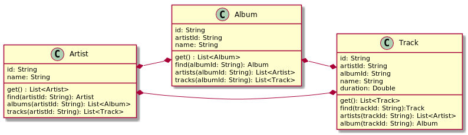
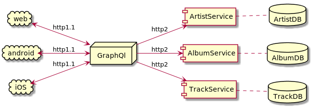
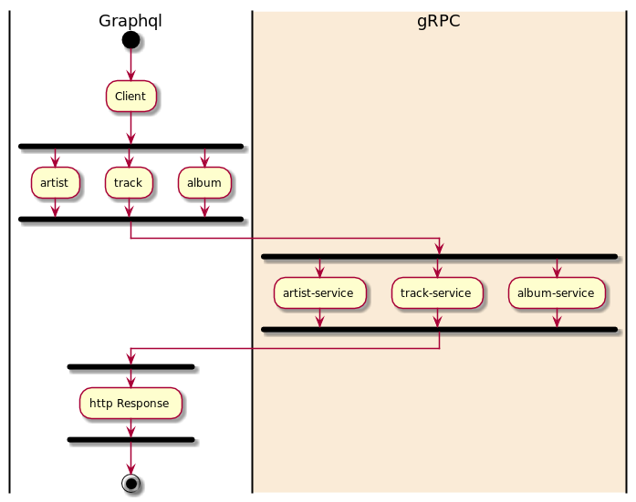

# gql-server
Creating a graphql server with java-springboot

## Scope
This repository is used to create a graphql server. The idea is to expose queries and mutations for three entities:
- Artists
- Albums
- Tracks

The relationship between the entities is defined below:

## Architecture

## Deployment
The project is container ready. To deploy use the steps below

- Change the image tag version in docker-compose.

- Run `sudo docker-compose build`

- Run `sudo docker push prakharsrivastav/gql:<tag>`, to push to docker hub

- Change the image tag version in the `k8s/dployment.yml`

- deploy to kubernetes using `sudo kubectl apply -f k8s/service.yml` and `sudo kubectl apply -f k8s/deployment`

## Communication

## Improvements

- Automated build on commit
- Automated tests